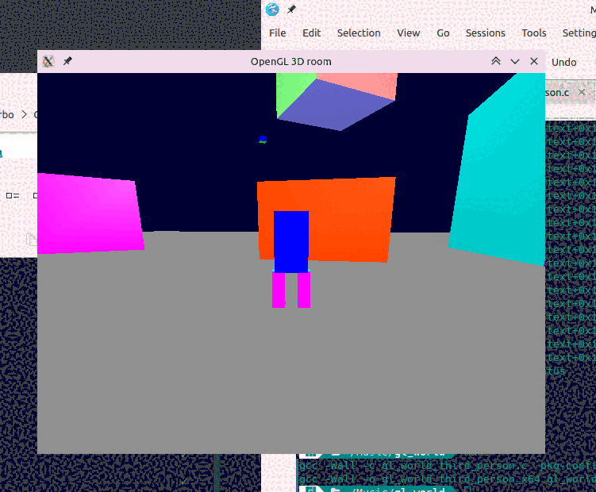

# OpenGL3Droom
A classic OpenGL open world third person camera sample program written in SDL(Simple DirectMedia Layer). Proper mouse view constraints like high end games.

Move mouse to rotate the world view.
Scroll mouse to zoom in and zoom out the view.
WASD keys to move around.
Directional arrow keys to rotate the view.
M/N keys to move world light.
f key to toggle fullscreen.
excape key to shut the program.

See the program below:

*For usages and applications restrictions please refer to LICENSE.txt*

Cheers!

Imam Hossain (emamhd@gmail.com)
